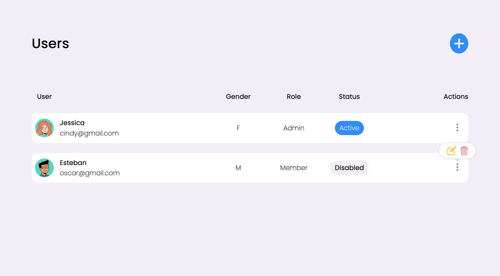
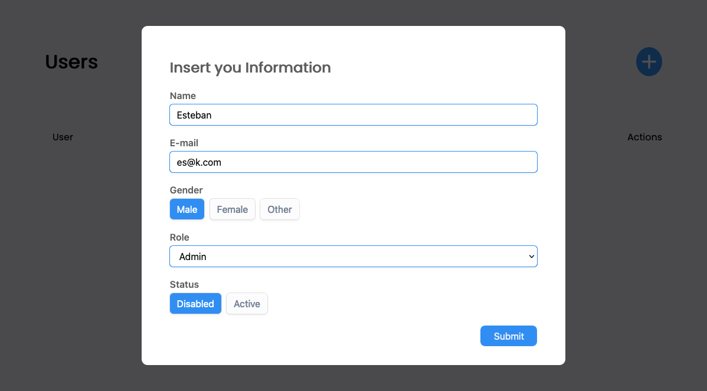

# CRUD DOM by Esteban Guzmán.

## Table of contents

-   [Overview](#overview)
    -   [The challenge](#the-challenge)
    -   [Screenshot](#screenshot)
    -   [Links](#links)
-   [My process](#my-process)
    -   [Built with](#built-with)
    -   [What I learned](#what-i-learned)
    -   [Useful resources](#useful-resources)
-   [Author](#author)

## Overview

### The challenge

Users should be able to:

-   View the optimal functions of adding, deleting, and updating users.

-   Change the themes to light and dark.

### Screenshot

 

### Links

-   Live Site URL: [website](https://eban-crud.netlify.app/)

## My process

### Built with

-   Semantic HTML5 markup
-   BEM methodology
-   SCSS custom properties and components methodology
-   Flexbox
-   Vanilla JavaScript

### What I learned

I've learned a lot of things. First how to manipulate data and the DOM. How to use fragments and HTML5 templates and complement to create, read, update and delete nodes.

### Continued development

The SCSS has to be refactor, mixins, functions and more will be used. The JS logic too. Maybe the data can be stored in localStorage or other place. Maybe a dark theme toggler.

### Useful resources

-   [Sass Documentation](https://sass-lang.com/documentation) - This helped me getting to know more the preprocessor.

-   [MDN Web Docs](https://developer.mozilla.org/en-US/) - This is an amazing website for documentation of CSS and web in general.

-   [DEV](https://dev.to/alexmercedcoder/frontend-crud-with-plain-vanilla-js-35cd) - This blog helped me with the initial logic.

## Author

-   Frontend Mentor - [@ebanguz](https://www.frontendmentor.io/profile/ebanguz)

-   Twitter Account - [@eban_guz](https://twitter.com/eban_guz)
